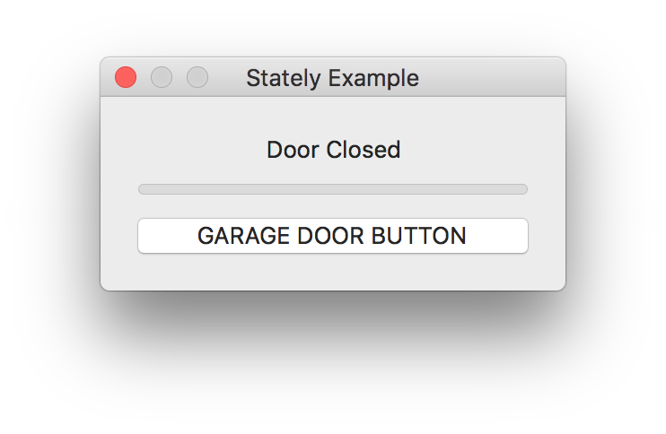
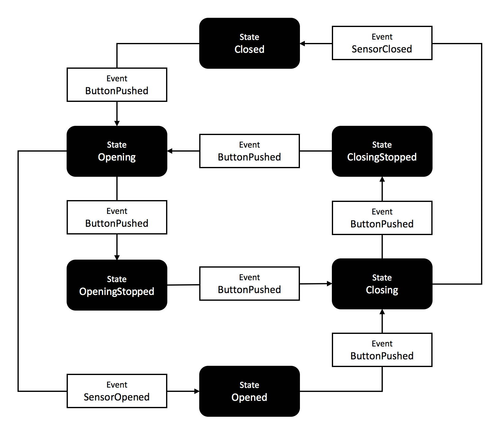

# StatelyExample [](https://raw.githubusercontent.com/softwarenerd/StatelyExample/master/LICENSE.md) [](https://github.com/softwarenerd/StatelyExample/releases)

## Introduction 

[StatelyExample](https://github.com/softwarenerd/StatelyExample) is an example application for [Stately](https://github.com/softwarenerd/Stately) that simulates a single-button garage door opener.



### State Machine

[StatelyExample](https://github.com/softwarenerd/StatelyExample) uses [Stately](https://github.com/softwarenerd/Stately) to build the state machine in the following diagram:



This state machine simulates the states and events of a singe-button garage door opener.

## Getting Started

### Clone StatelyExample

```sh
git clone git@github.com:softwarenerd/StatelyExample.git
```

### Build Dependencies

```sh
carthage bootstrap --platform macOS
```

### Open and run StatelyExample

Using Xocde, open and run StatelyExample.xcodeproj

## Contributing

StatelyExample is a work in progress and your contributions are most welcome. Feel free to fork the repo and submit PR's.

## License

StatelyExample is released under the [MIT License](LICENSE.md).
